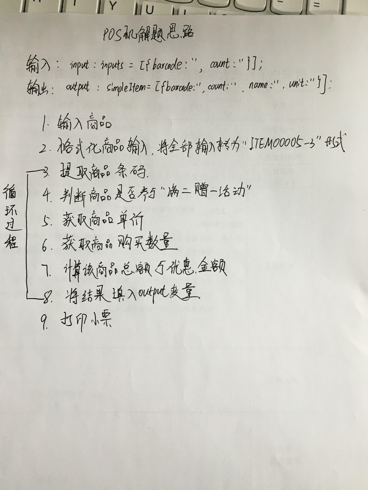

#解题思路手写版#

#POS机解题思路#

1. 调用formatInputData将数据数据格式化成‘ITEM000003-2’的形式，例如，输入   
 [   
    'ITEM000001',  
    'ITEM000001',  
    'ITEM000001',  
    'ITEM000001',  
    'ITEM000001',  
    'ITEM000003-2',  
    'ITEM000005',  
    'ITEM000005',  
    'ITEM000005'  
]，  
则格式化为：  
[  
    'ITEM000001-5',  
    'ITEM000003-2',  
    'ITEM000005-3'  
]  

2. 调用loadAllItems()获取商品信息；
   调用loadPromotions()获取打折信息

3. 遍历formatInput：
   首先，调用discountInfo()判断商品是否打折,输入参数：商品的编号(ITEM000001)，promotionInfo(商品打折信息)；输出参数:true(买二送一)，false(不打折)。  
   其次，调用getPrice()获取商品单价,输入参数:商品的编号(ITEM000001)，allItems(商品信息);输出参数:商品单价。   
   接着，获取该商品的购买数量。    
   最后，调用calculateCharge()获取该商品的总价和优惠的金额，输入参数:price(商品单价)，count(购买数量),hasDiscount(是否打折);输出参数：charge(该商品的收费),discount(优惠的金额)   
 
4. 调用printReceipt()按照格式打印小票

##伪代码如下：##
 
    function printInventory(input){       
        var formatInput = formatInputData(input);   
        var allItems = loadAllItems();   
        var promotionInfo = loadPromotions();   
        var output;
        for(var i=0;i<formatInput.length;i++){
            var hasDiscount = discountInfo(formatInput[i].substring(0,11),promotionInfo);//商品是否打折
            var price = getPrice(formatInput[i].substring(0,11),allItems);//商品单价
            var count = Number(formatInput[i].substring(12,formatInput[i].length));//购买的商品数量
            var discount;//优惠金额
            var charge = calculateCharge(price,count,hasDiscount,discount);//根据打折信息计算价格
            output[i].product = getProductName(formatInput[i].substring(0,11));
            output[i].count = count;
            output[i].price = price;
            output[i].charge = charge;
            output[i].discount = discount;
        }
        printReceipt(output);
    }

##相关函数##
1.    
    /*   
	 *@param   
	 *input:输入的数组    
	 *@return     
	 *formatInput:返格式化后的数组   
	 */    
   formatInputDataI(input);      

2.   
     /*   
	 *@param   
	 *itemNumber:商品条码编号
     *promotionInfo:所有商品的打折信息    
	 *@return    
	 *hasDiscount:商品是否参加买二送一的活动   
	 */    
   discountInfo(formatInput,promotionInfo);        

3.  /*      
	 *@param   
	 *itemNumber:商品条码编号   
     *allItemsInfo:所有商品的信息列表    
	 *@return    
	 *price:商品单价   
	 */    
   getPrice(itemNumber,allItemsInfo);  
   
4.  /*      
	 *@param   
	 *price:商品单价   
     *count:商品数量   
     *hasDiscount:是否打折    
     *discount:优惠的价格(输出参数)   
	 *@return    
	 *charge:商品总价   
	 */  
   calculateCharge(price,count,hasDiscount,discount);   
   
5. /*      
	 *@param   
	 *output:准备输出的商品信息     
	 */  
   printReceipt(output);
   